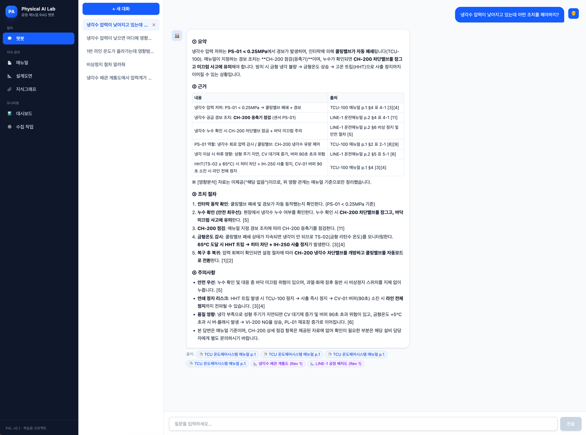
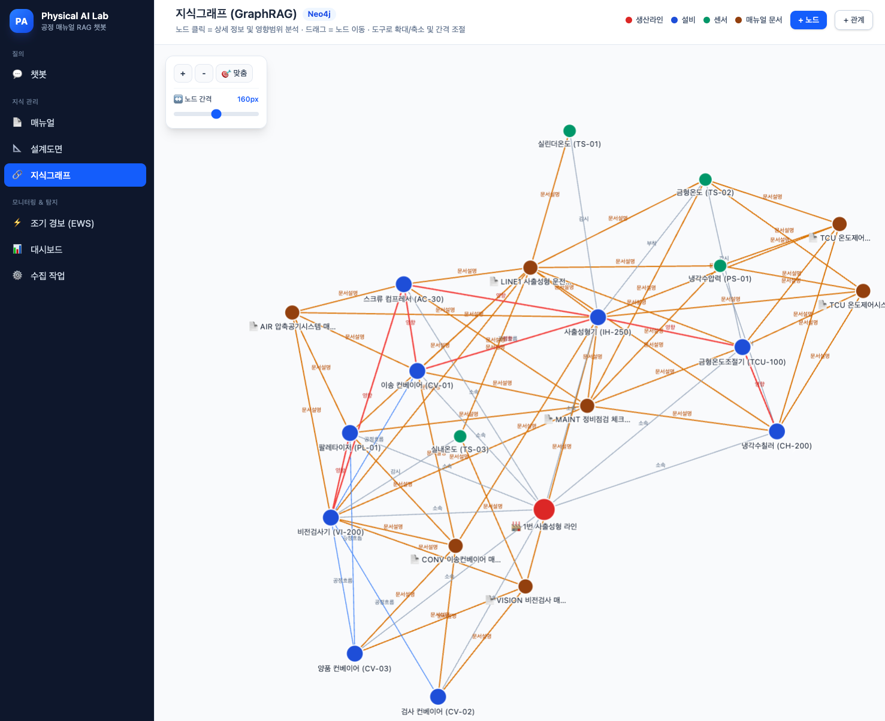
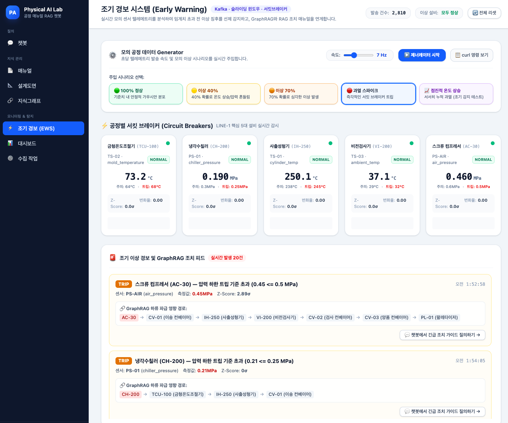

# Physical AI Lab (PAL)

공정 매뉴얼, 설계도면 기반 RAG 챗봇 서비스

공정 설계도 및 매뉴얼 데이터와 설비 간 Graph 관계도를 통해 맥락 기반 응답 제공

## PoC 단계
- [x] RAG + Graph RAG 구축
- [x] 데이터 적재
- [x] 챗봇 및 대시보드 구현
- [x] 조기 경보 시스템
  - [x] 모의 공정 데이터 Generator 추가 (초당 1~50Hz, 5종 시나리오)
  - [x] 모의 공정 데이터 파이프라인 구축 (Kafka `telemetry.line1` 스트림)
  - [x] 조기 이상 탐지 시스템 설계 (슬라이딩 윈도우 통계, 서킷 브레이커, GraphRAG/RAG 연동)
- [ ] 개선
  - [ ] Semantic Caching 적용
  - [ ] pdf 추출 시 이미지 url replace 작업 및 청킹 개선 (경량 llm 통해서 다음 Chunking 전략 하나 선택 - Fixed-size, Recursive, Structured, Agentic -> 추후 추가 필요..)
  - [ ] RAG 응답 평가 시스템 구축
  - [ ] Observability

## PoC 데모

<p align="center">
  
  
  
</p>

> 📚 **문서**
> - **[docs/EARLY_WARNING_SYSTEM.md](docs/EARLY_WARNING_SYSTEM.md)** — 조기 경보 시스템 기술 명세 및 가이드
> - **[docs/INGESTION_STRATEGY.md](docs/INGESTION_STRATEGY.md)** — PDF 파싱 및 청킹/하이브리드 인덱싱 가이드
> - **[docs/WORKPLAN.md](docs/WORKPLAN.md)** — 프로젝트 작업서 (아키텍처·API·데이터 설계·ADR)
> - **[docs/PROGRESS.md](docs/PROGRESS.md)** — 진행 상황 (Phase 0~7 완료)
> - [AGENTS.md](AGENTS.md) — AI 에이전트 작업 가이드

## 무엇을 할 수 있나?

| 기능 | 설명 |
|---|---|
| ⚡ **조기 경보 (EWS)** | 실시간 모의 텔레메트리 스트리밍 + 슬라이딩 윈도우 통계(Z-score/변화율) + 공정별 서킷 브레이커 + GraphRAG 하류 영향도 연계 |
| 💬 **RAG 챗봇** | 매뉴얼 PDF 기반 답변을 **SSE 스트리밍** + 출처(문서·페이지) 표시 |
| 🔗 **GraphRAG** | "1번 라인 온도 영향범위" 같은 질문에 Neo4j 지식그래프 분석을 결합해 상·하류 설비 영향 답변 |
| 📐 **도면 관리** | 설계도면 등록/수정/리비전 → 챗봇 답변에 원본 도면 첨부(클릭 시 뷰어) |
| 📄 **매뉴얼 관리** | PDF 업로드 → Kafka→파싱→청킹→임베딩→Milvus 적재 파이프라인 (상태 실시간 추적) |
| 🔍 **하이브리드 검색** | dense(bge-m3) + BM25를 RRF로 융합 |
| 📊 **대시보드/파이프라인** | 지표 요약, 수집 작업 이력/에러/DLQ 확인 |


## 빠른 시작

```bash
# 0) 사전 준비: GLM Coding Plan 키
cp .env.example .env    # 최초 clone 시 — GLM_API_KEY 입력

# 1) 전체 스택 기동 (첫 회는 이미지 pull로 수 분)
make up
# 웹:  http://localhost:5173
# API: http://localhost:8000/docs

# 2) 샘플 데이터 (매뉴얼 PDF 6종 + 도면 PNG 3종 생성 → 시드 → 업로드/수집)
make gen-data
curl -X POST http://localhost:8000/api/v1/graph/reseed
./backend/scripts/upload_samples.sh
# 도면은 관리 페이지(http://localhost:5173/drawings)에서 직접 등록해보세요
```

**종료**: `make down` (데이터 유지) / **완전 초기화**: `make reset` (⚠️ 볼륨 삭제)

## 명령어

| 명령 | 설명 |
|---|---|
| `make up` / `make down` / `make reset` | 기동 / 종료 / 초기화 |
| `make up-debug` | + 웹 콘솔 (mongo:8911, milvus:8912, kafka:8913) |
| `make gen-data` | 샘플 매뉴얼·도면 생성 |
| `make logs s=api` | 서비스별 로그 |
| `make build` | 의존성 변경 시 재빌드 |
| `make test` / `make fmt` | 백엔드 테스트(25종) / 포맷·린트 |
| `make telemetry-start` | 모의 텔레메트리 제너레이터 가동 (정상 모드) |
| `make telemetry-anomaly-40` | 이상 40% 시나리오 주입 |
| `make telemetry-anomaly-70` | 이상 70% 고위험 시나리오 주입 |
| `make telemetry-spike` | 급격한 과열 스파이크(트립) 주입 |
| `make telemetry-reset` | 서킷 브레이커 전체 리셋 |
| `make telemetry-stop` | 텔레메트리 제너레이터 정지 |


## 아키텍처 한눈에

```
프론트(Vite+React+TS) → FastAPI(api) ─┬─ MongoDB   (문서/도면/채팅/작업 메타)
   │SSE 스트리밍                       ├─ Milvus    (청크/도면 벡터, HNSW+BM25)
   │                                  ├─ Neo4j     (설비 영향범위 그래프)
   ├─ Redpanda(Kafka) → worker (수집 파이프라인, 재시도/DLQ)
   ├─ Redis (임베딩 캐시)
   ├─ LLM API (채팅, 현재 z.ai Coding Plan GLM5.3 기반 챗봇 응답 제공)
   └─ Ollama bge-m3 (로컬 임베딩, 1024차원)
```

## 문제 해결

| 증상 | 조치 |
|---|---|
| 헬스 `degraded` | `/api/v1/health`에서 컴포넌트 확인 → `make logs s=api` |
| 답변 본문이 안 나옴 | GLM 추론 토큰 소진 가능 → `.env`의 `LLM_THINKING=disabled` 확인 (기본값) |
| GLM 오류 1113(잔액) | `LLM_BASE_URL`이 `https://api.z.ai/api/coding/paas/v4`인지 확인 |
| 문서 FAILED | 매니저 파이프라인에서 텍스트 추출 실패(스캔본 등). 파이프라인 페이지에서 에러 확인 |
| 검색 품질 | `RETRIEVAL_TOP_K` 조정, 하이브리드 실패 시 dense 폴백 로그 확인 |
| 코드 수정 미반영 | api는 자동 reload. 의존성 변경은 `make build` 후 재기동 |
