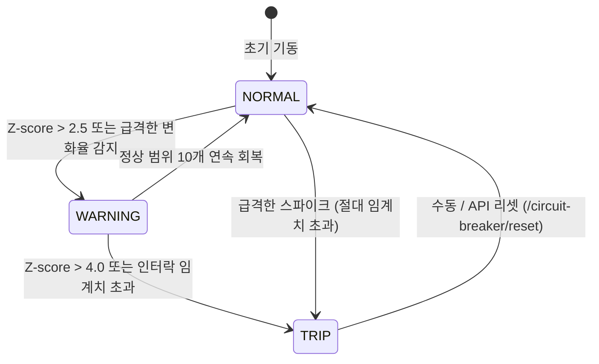

# 조기 경보 시스템 (Early Warning & Anomaly Detection System)

> 본 문서는 Physical AI Lab(PAL)의 **실시간 모의 공정 텔레메트리 스트리밍, 슬라이딩 윈도우 기반 통계적 이상 탐지, 공정별 서킷 브레이커(Circuit Breaker), GraphRAG/RAG 연계 경보 시스템**의 기술 명세 및 사용 가이드이다.

---

## 1. 시스템 아키텍처

```mermaid
flowchart TD
    subgraph SENSORS [모의 센서 텔레메트리]
        TCU[TCU-100: TS-02 금형온도]
        CH[CH-200: PS-01 냉각수압력]
        IH[IH-250: TS-01 실린더온도]
        VI[VI-200: TS-03 실내온도/불량률]
        AC[AC-30: 공기압]
    end

    subgraph ENGINE [제너레이터 & 카프카]
        GEN[TelemetryGenerator<br/>1~50 msg/s]
        SCENARIO[시나리오 제어기<br/>NORMAL / 40% / 70% / SPIKE / DRIFT]
        SCENARIO --> GEN
        SENSORS -.-> GEN
        GEN -->|Publish| TOPIC{{Topic: telemetry.line1}}
    end

    subgraph DETECTOR [실시간 이상 탐지기]
        CONSUMER[Kafka Consumer]
        SLIDE[Sliding Window Buffer (N=30)<br/>Rolling Mean / Std / Z-score / Slope]
        CIRCUIT{공정 서킷 브레이커<br/>NORMAL / WARNING / TRIP}
        TOPIC --> CONSUMER --> SLIDE --> CIRCUIT
    end

    subgraph RESPONSE [지능형 알람 & 대응]
        NEO4J[(Neo4j: 하류 영향 설비 Traversal)]
        RAG[(Milvus RAG: 매뉴얼 긴급 조치 가이드)]
        CIRCUIT -->|이상 경보 발동| NEO4J
        CIRCUIT -->|이상 경보 발동| RAG
    end

    subgraph UI [실시간 모니터 대시보드]
        SSE[SSE 스트림: /api/v1/telemetry/stream]
        DASH[/early-warning 웹 대시보드]
        CIRCUIT --> SSE --> DASH
    end
```

---

## 2. 모의 센서 및 데이터 규격

### 2.1 대상 설비 및 센서 스펙
| 설비 ID | 설비명 | 센서 ID | 메트릭 | 단위 | 정상 범위 | 주의 (Warning) | 트립 (Trip / Critical) |
|---|---|---|---|---|---|---|---|
| `TCU-100` | 금형온도조절기 | `TS-02` | `mold_temperature` | °C | 58.0 ~ 62.0 | $\ge 64.0$ | $\ge 68.0$ (인터락 트립) |
| `CH-200` | 냉각수칠러 | `PS-01` | `chiller_pressure` | MPa | 0.35 ~ 0.50 | $\le 0.30$ | $\le 0.25$ (저압 경보) |
| `IH-250` | 사출성형기 | `TS-01` | `cylinder_temp` | °C | 215.0 ~ 230.0 | $\ge 238.0$ | $\ge 245.0$ (과열 트립) |
| `VI-200` | 비전검사기 | `TS-03` | `ambient_temp` | °C | 22.0 ~ 26.0 | $\ge 29.0$ | $\ge 32.0$ (오판정 급증) |
| `AC-30` | 컴프레서 | `PS-AIR` | `air_pressure` | MPa | 0.70 ~ 0.85 | $\le 0.60$ | $\le 0.50$ (공기압 부족) |

### 2.2 텔레메트리 메시지 스키마
```json
{
  "timestamp": "2026-08-15T01:35:00.123Z",
  "line_id": "LINE-1",
  "equipment_id": "TCU-100",
  "sensor_id": "TS-02",
  "metric_name": "mold_temperature",
  "value": 63.4,
  "unit": "°C",
  "status": "NORMAL"
}
```

---

## 3. 이상 탐지 알고리즘 (Sliding Window & Circuit Breaker)

### 3.1 슬라이딩 윈도우 통계 모델
각 센서별로 최근 $N=30$개의 측정치를 FIFO 버퍼로 유지하며 아래 지표를 실시간 계산한다.

1. **이동 평균 ($\mu$) 및 이동 표준편차 ($\sigma$)**:
   $$\mu = \frac{1}{N}\sum_{i=1}^{N} x_i, \quad \sigma = \sqrt{\frac{1}{N}\sum_{i=1}^{N} (x_i - \mu)^2}$$
2. **동적 Z-Score**:
   $$Z = \frac{|x_t - \mu|}{\sigma + \epsilon}$$
   ($\epsilon=10^{-4}$는 분모 0 방지)
3. **변화율 (Slope $\frac{\Delta x}{\Delta t}$)**:
   최근 5개 표본의 1차 회귀 기울기를 계산하여 **절대 상한에 도달하기 전 급격한 과열/압력 급락 추세를 선제 감지**.

### 3.2 3단계 공정 서킷 브레이커 (Circuit Breaker)


- **`NORMAL` (정상 - 초록)**: 정상 가동 상태.
- **`WARNING` (조기 경보 - 주황)**: 통계적 이상 징후 발생. 현장 엔지니어에게 조기 경보 전송.
- **`TRIP` (서킷브레이커 차단 - 빨강)**: 인터락 한계 초과. 공정보호를 위해 차단 상태로 전이되며, GraphRAG 하류 영향도 분석 및 RAG 조치 매뉴얼이 자동 팝업됨.

---

## 4. 시뮬레이션 시나리오 및 curl 제어 방법

### 4.1 지원 시나리오
1. `NORMAL`: 100% 정상 작동 (가우시안 노이즈)
2. `ANOMALY_40`: 40% 확률로 간헐적 금형온도 상승 및 칠러 압력 변동 주입
3. `ANOMALY_70`: 70% 확률로 고위험 온도 상승 및 인터락 근접
4. `CRITICAL_SPIKE`: 즉각적인 서킷브레이크 트립(72°C 고온 및 0.18MPa 저압) 주입
5. `DRIFT`: 30초에 걸쳐 온도가 점진적으로 상승하여 조기 감지 성능을 테스트

### 4.2 주요 curl 명령

#### 1) 텔레메트리 제너레이터 시작 (기본 5 Hz)
```bash
curl -X POST "http://localhost:8000/api/v1/telemetry/generator/start?hz=10"
```

#### 2) 이상 40% 시나리오 주입
```bash
curl -X POST http://localhost:8000/api/v1/telemetry/generator/scenario \
  -H "Content-Type: application/json" \
  -d '{"scenario": "ANOMALY_40"}'
```

#### 3) 이상 70% 시나리오 주입
```bash
curl -X POST http://localhost:8000/api/v1/telemetry/generator/scenario \
  -H "Content-Type: application/json" \
  -d '{"scenario": "ANOMALY_70"}'
```

#### 4) 급격한 과열 스파이크 (트립 테스트)
```bash
curl -X POST http://localhost:8000/api/v1/telemetry/generator/scenario \
  -H "Content-Type: application/json" \
  -d '{"scenario": "CRITICAL_SPIKE"}'
```

#### 5) 정상 모드로 복귀
```bash
curl -X POST http://localhost:8000/api/v1/telemetry/generator/scenario \
  -H "Content-Type: application/json" \
  -d '{"scenario": "NORMAL"}'
```

#### 6) 서킷 브레이커 수동 리셋
```bash
curl -X POST http://localhost:8000/api/v1/telemetry/circuit-breaker/reset
```

#### 7) 제너레이터 정지
```bash
curl -X POST http://localhost:8000/api/v1/telemetry/generator/stop
```

#### 8) Makefile 단축 명령
```bash
make telemetry-start       # 제너레이터 시작 (정상 모드)
make telemetry-anomaly-40  # 이상 40% 주입
make telemetry-anomaly-70  # 이상 70% 주입
make telemetry-spike       # 과열 스파이크 주입
make telemetry-stop        # 제너레이터 중지
```

---

## 5. 감시 대상 관리 — 그래프가 단일 진실 공급원 (SSOT)

### 5.1 구조
감시 대상 설비/센서는 **Neo4j 그래프의 Sensor 노드**에서 로드한다 (`MonitorRegistry`).
코드 어딘가에 설비 목록이 하드코딩되지 않는다.

- Sensor 노드 props: `metric_name`, `unit`, `warning_threshold`, `trip_threshold`,
  `is_lower_limit`, `base_mean`, `base_std` (시뮬레이터용)
- `Sensor-[:MONITORS]->Equipment` 관계로 감시 대상 지정
- 그래프 불가 시 `DEFAULT_PROFILES`(시드 동일값)로 폴백 — `source: default`

### 5.2 설비 추가/삭제 흐름
| 상황 | 동작 |
|---|---|
| 그래프 UI/API로 센서+MONITORS 추가 → `POST /telemetry/registry/reload` | 즉시 감시 목록 반영 (상태/창 유지) |
| 그래프에서 노드 삭제 → reload | 감시 목록에서도 제거 (registry_changed SSE) |
| **모르는 설비의 텔레메트리 수신** | 자동 등록(`source: auto`) — 그래프에 Equipment+Sensor 노드 자동 생성, 임계치 없이 **통계 전용(Z-score) 감시**. 그래프에서 임계치를 채우면 다음 reload부터 절대 임계 감시 |

### 5.3 관련 API
```bash
# 그래프 편집 후 감시 대상 재로드
curl -X POST http://localhost:8000/api/v1/telemetry/registry/reload

# 감시 대상 목록 (source: graph|default|auto)
curl http://localhost:8000/api/v1/telemetry/circuit-breakers
```

> 알람 이력은 MongoDB `early_warning_alerts` 컬렉션에 영속화되어 재시작 후에도 유지된다.

---

## 6. 프론트엔드 대시보드 (`/early-warning`)

- 브라우저에서 `http://localhost:5173/early-warning` 접속 시 다음 기능을 제공합니다:
  - **시나리오 제어 바**: 버튼 클릭 한 번으로 시나리오 전환 및 초당 발송 빈도 조절
  - **공정별 서킷 브레이커 카드**: 그래프 기반 동적 감시 목록(자동 등록 AUTO 뱃지 포함) 실시간 상태/수치/Z-score/스파크라인/리셋
  - **실시간 스트리밍 차트**: 센서별 시계열 그래프 및 경보 임계 기준선 표시
  - **지능형 알람 피드**: 경보 발생 시 **GraphRAG 하류 영향 설비 경로**와 **매뉴얼 긴급 조치 가이드 요약** 즉시 확인
  - **챗봇 자동 질의**: 알람의 "챗봇에서 긴급 조치 가이드 질의하기" 버튼 → `/chat?ask=...` 로 이동하며 **질문이 자동 전송**되어 GLM-5.3이 영향범위+조치 절차를 즉시 답변
