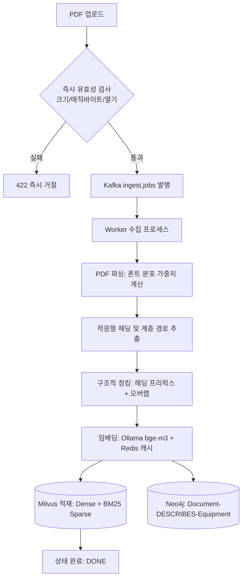

# Physical AI Lab — PDF 추출 및 청킹 전략 가이드

> 본 문서는 Physical AI Lab(PAL)의 **문서 수집(Ingestion) 파이프라인, PDF 구조 파싱, 청킹(Chunking) 기법, 임베딩 및 인덱싱 전략**을 상세히 설명하는 기술 문서이다.

---

## 1. 개요 및 설계 목표

스마트공장의 공정 매뉴얼과 운영 가이드는 일반 텍스트 문서와 달리 다음과 같은 뚜렷한 특징을 지닌다.
- **계층적 구조**: 대제목(1.), 중제목(1.1), 소제목(1.1.1) 등 엄격한 목차와 계층을 가짐.
- **파라미터 및 설비 중심**: 특정 설비 코드(예: `IH-250`, `TCU-100`)와 연계된 임계치, 알람 기준, 인터락 조건이 핵심 정보임.
- **다양한 작성 도구**: Word, PowerPoint, 한글(HWP), 특수 매뉴얼 툴 등에서 PDF로 변환되어 폰트 크기와 레이아웃이 표준화되어 있지 않음.

PAL의 수집 파이프라인은 이러한 공정 문서의 특성을 고려하여 **문맥 손실 없는 고품질 RAG 검색**을 제공하도록 설계되었다.



---

## 2. PDF 텍스트 추출 및 구조 파싱 전략

### 2.1 절대 임계값 방식의 한계와 실패 원인
기존의 단순 PDF 파서는 `12pt 이상이면 헤딩, 미만이면 본문`과 같은 절대 임계값을 사용한다.
- **문제점**: PowerPoint에서 내보낸 PDF는 본문 폰트가 12~14pt로 작성되는 경우가 흔하여, **본문 전체가 헤딩으로 오분류되어 본문 텍스트가 0자가 되는 참사**가 발생함.
- 반대로 폰트가 작은 기술 규격서의 경우 10pt의 소제목이 본문으로 취급되어 목차 계층이 소실됨.

### 2.2 해결책: 글자 수 가중 '폰트 분포 기반 적응형 헤딩 감지'
PAL 파서(`worker/parser/pdf_parser.py`)는 문서 전체를 1차 스캔하여 **글자 수(Character length) 가중치 최빈 폰트 크기**를 본문 크기(`body_size`)로 자동 산출한다.

$$\text{body\_size} = \operatorname{mode}_{\text{char\_weighted}}(\text{font\_size})$$

1. **본문 크기 산출**: 각 폰트 크기별로 등장한 글자 수를 누적하여 가장 많은 분량을 차지하는 크기를 기준 본문 크기로 확정.
2. **헤딩 임계값 설정**: 
   $$\text{heading\_threshold} = \text{body\_size} + 1.5\text{pt}$$
   본문 크기보다 1.5pt 이상 큰 라인만을 헤딩 후보로 분류.
3. **헤딩 유효성 검증**:
   - 길이 제한: $2 \le \text{len}(\text{text}) \le 80$
   - 기호 전용 라인 필터링: 순수 기호(`---`, `***`, `===`) 제외, 한글/영문/숫자가 1자 이상 포함된 라인만 헤딩으로 승격.
4. **표지 제목(Title) 추출**: 문서 전체에서 가장 큰 폰트 크기 라인 중 첫 번째 라인을 문서 제목으로 추출.
5. **안전 폴백(Fallback)**:
   - 모든 라인이 헤딩으로 분류되어 본문이 비어 있는 특수 PDF의 경우, 헤딩 라인들을 합쳐 단일 섹션으로 자동 병합하여 빈 청크 오류 방지.
   - 텍스트가 전혀 없는 스캔본/이미지 전용 PDF는 즉시 식별하여 명확한 에러 메시지 반환.

---

## 3. 청킹(Chunking) 전략

### 3.1 헤딩 계층 프리픽스 주입 (Context Enrichment)
RAG 검색 시 단일 청크만 가져오면 "이 내용이 어느 설비의 어떤 절차에 관한 설명인지" 문맥이 잘려나가는 문제가 발생한다.
PAL 청커(`worker/pipelines/chunker.py`)는 각 청크의 본문 맨 앞에 **문서 제목과 상위 헤딩 경로를 명시적으로 주입**한다.

```text
[TCU-100 금형온도조절기 운전 매뉴얼 > 3. 비상 정지 및 인터락 > 3.2 금형온도 초과 시 인터락]
금형온도가 설정 상한(140°C)을 5°C 이상 초과할 경우 경보음이 발생하며,
사출성형기(IH-250)의 형폐 동작 인터락이 작동하여 자동으로 정지합니다.
```

- **효과**: 임베딩 벡터 생성 시 및 BM25 키워드 매칭 시 `TCU-100`, `매뉴얼`, `인터락` 등의 상위 개념이 벡터/인덱스에 함께 반영되어 검색 적중률이 비약적으로 상승함.

### 3.2 슬라이딩 윈도우 & 오버랩 분할
- **최대 청크 길이 (`chunk_max_chars`)**: 기본 800자 (헤딩 프리픽스 길이 포함).
- **오버랩 길이 (`chunk_overlap_chars`)**: 기본 100자.
- **문단 우선 분할**: 줄바꿈(`\n`) 단위의 문단 구조를 최대한 보존하면서 결합. 단일 문단이 800자를 초과할 경우에만 오버랩을 유지하며 하드 분할 수행.

### 3.3 설비 엔티티 추출 및 지식그래프 연계
청킹 및 파싱 완료 후 정규표현식(`[A-Z]{2,4}-\d{2,3}`)으로 본문에 포함된 설비 코드(`IH-250`, `TCU-100`, `CH-200`, `VI-200` 등)를 자동 추출한다.
- MongoDB 문서 메타데이터의 `equipment_refs` 배열에 기록.
- Neo4j 지식그래프에 `(Document)-[:DESCRIBES]->(Equipment)` 엣지를 자동 생성하여 GraphRAG와 상호 연결.

---

## 4. 임베딩 및 인덱싱 전략

| 구분 | 사양 | 역할 및 특징 |
|---|---|---|
| **임베딩 모델** | `bge-m3` (1024차원) | Ollama 로컬 컨테이너 서빙, 다국어 및 한국어 고성능 지원 |
| **임베딩 캐시** | Redis 7 (`emb:bge-m3:{sha256}`) | 동일 텍스트 재수집/재계산 방지 (TTL 7일) |
| **Dense Index** | Milvus 2.5 HNSW (COSINE) | 의미론적 유사도 벡터 검색 (`ef=64`, $M=16$) |
| **Sparse Index** | Milvus 2.5 BM25 (standard) | 정확한 설비 코드/전문 용어 키워드 검색 |
| **검색 융합** | RRF (Reciprocal Rank Fusion) | Dense 순위와 Sparse 순위를 결합하여 최적 top-k 산출 |

---

## 5. 수집 에러 처리 및 안정성 전략

1. **API 진입점 즉시 검증 (Fast-Fail)**:
   - 0바이트 빈 파일, 50MB 초과 파일, 파일 헤더가 `%PDF`가 아닌 파일, 손상/암호화된 PDF는 업로드 즉시 HTTP 422 `ValidationAppError`를 발생시켜 사용자에게 명확한 사유를 전달하고 Kafka 큐 진입을 원천 차단.
2. **워커 예외 분류**:
   - **치명적 오류 (Non-retryable)**: 텍스트 추출 0자, 손상된 파일 구조 등은 3회 재시도 대기(20+초) 없이 즉시 `FAILED/DEAD` 처리하고 원인 예외 메시지를 `document.error`에 영구 보존.
   - **일시적 오류 (Retryable)**: 네트워크 단절 등은 지수 백오프(5s/15s/45s)로 3회 재시도하며, 최종 실패 시에도 상세 근본 원인을 유지.
3. **청크 검사 지원**:
   - `GET /api/v1/documents/{id}/chunks` API와 프론트엔드 `청크 뷰어 모달`을 통해 분할된 청크의 순번, 페이지, 헤딩 경로, 텍스트, 글자 수를 실시간 열람 가능.
