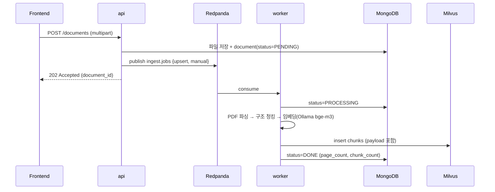
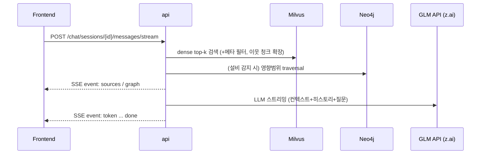

# Physical AI Lab (PAL) — 프로젝트 작업서

> **이 문서는 본 프로젝트의 단일 진실 공급원(SSOT, Single Source of Truth)이다.**
> AI 에이전트는 세션이 새로 시작되더라도 반드시 이 문서를 먼저 읽고, `docs/PROGRESS.md`의 현재 Phase를 확인한 뒤 작업을 이어간다.
> 설계를 변경한 경우 이 문서를 즉시 수정하고, 작업을 완료한 경우 `docs/PROGRESS.md`를 갱신한다.

---

## 0. 프로젝트 개요

### 0.1 목표
스마트공장의 **공정 매뉴얼(PDF)과 설계도면을 RAG로 활용하는 챗봇 서비스**를 학습 목적으로 구축한다.

### 0.2 성공 기준 (Acceptance)
1. `make bootstrap` 한 번으로 전체 스택 기동 후, 샘플 매뉴얼/도면이 자동 적재된다.
2. 챗봇에서 "1번 라인 온도가 올라가는데 영향범위를 알려줘" 같은 질문에 **출처(문서명/페이지)를 명시한** 답변을 스트리밍한다.
3. 관리 페이지에서 매뉴얼 PDF를 추가/삭제하고, 설계도면을 등록/수정/삭제(revision 포함)할 수 있다.
4. 영향범위 질문 시 Neo4j 그래프 분석 결과가 답변에 반영되고, 그래프 뷰에서 하이라이트된다.

---

## 1. 서비스 정의

### 1.1 기능 요약
| 기능 | 설명 |
|---|---|
| 매뉴얼 수집(ingestion) | PDF 업로드 → 비동기 파이프라인(Kafka) → 파싱/청킹/임베딩 → Milvus 적재. 상태(PENDING/PROCESSING/DONE/FAILED) 추적 |
| RAG 챗봇 | 질문 → Milvus 검색 → 출처와 함께 스트리밍(SSE) 답변. 채팅 세션/히스토리 관리 |
| 영향범위 분석(GraphRAG) | 질문에서 설비/파라미터 감지 → Neo4j traversal로 상·하류 영향 설비 도출 → RAG 컨텍스트에 주입 |
| 설계도면 관리 | 도면(PNG/JPG/PDF) 등록/수정/삭제 + 리비전 관리. 도면은 챗봇 답변의 출처로 첨부되어 뷰어로 열람 가능 |
| 파이프라인 모니터링 | 수집 작업 목록/상태/에러 확인 |

### 1.2 핵심 유저 시나리오
1. **엔지니어 질의**: "금형온도가 5도 이상 올라가면 어떤 설비에 영향이 있어?" → 그래프 영향분석 + 매뉴얼 근거 + 관련 도면 원본 첨부.
2. **매뉴얼 등록**: 관리 페이지에서 새 PDF 드래그&드롭 → 상태 배지가 PENDING→PROCESSING→DONE으로 바뀌는 것을 실시간 확인.
3. **도면 관리**: 냉각수 배관 계통도를 신규 리비전으로 교체 → 이후 챗봇이 최신 리비전을 인용.

---

## 2. 아키텍처

### 2.1 전체 구성도

```mermaid
flowchart LR
  subgraph FE [Frontend · Vite+React+TS]
    UI[Chat / Manuals / Drawings / Graph / Pipeline]
  end
  subgraph BE [Backend]
    API["api · FastAPI (uvicorn)"]
    WK["ingest-worker (python 프로세스)"]
  end
  subgraph DATA [Data & Infra]
    M[(MongoDB<br/>메타·히스토리)]
    R[(Redis<br/>캐시·상태)]
    V[(Milvus<br/>벡터)]
    G[(Neo4j<br/>지식그래프)]
    K{{"Redpanda<br/>(Kafka API)"}}
  end
  subgraph CLOUD [AI · GLM API(외부 채팅) + Ollama(로컬 임베딩)]
    LLM["GLM-4.6<br/>(chat, Coding Plan)"]
    EMB["bge-m3 1024d<br/>(embedding)"]
  end
  UI -->|REST / SSE| API
  API --> M
  API --> R
  API --> V
  API --> G
  API -->|수집 이벤트 발행| K
  API <-->|chat 스트리밍| LLM
  K -->|consume| WK
  WK --> M
  WK --> V
  WK -->|embedding| EMB
```

### 2.2 docker compose 서비스 구성
| 서비스 | 이미지 | 호스트 포트 | 역할 |
|---|---|---|---|
| `frontend` | node:20 (dev) | 5173 | Vite dev server (HMR) |
| `api` | 프로젝트 이미지 (python:3.12-slim) | 8000 | FastAPI 앱 |
| `worker` | api와 동일 이미지, 커맨드만 다름 | - | Kafka consumer, 수집 파이프라인 |
| `mongo` | mongo:7 | 27017 | 메타데이터/채팅/작업 상태 |
| `redis` | redis:7-alpine | 6379 | 캐시·임베딩 캐시·스트림 보조 |
| `milvus` | milvusdb/milvus:v2.5.x | 19530 | 벡터 DB (standalone) |
| `milvus-etcd`, `milvus-minio` | - | - | Milvus 내부 의존성 |
| `neo4j` | neo4j:5-community | 7474 / 7687 | 지식그래프 |
| `redpanda` | redpandadata/redpanda:v24.x | 9092 | Kafka API 호환 브로커 (단일 노드) |
| `ollama` | ollama/ollama | 11434 | 로컬 임베딩(bge-m3 자동 pull) — Coding Plan에 임베딩 API가 없어 로컬 서빙 |
| `mongo-express` (profile: debug) | - | 8911 | Mongo 웹 콘솔 |
| `attu` (profile: debug) | zilliz/attu | 8912 | Milvus 웹 콘솔 |
| `redpanda-console` (profile: debug) | - | 8913 | Kafka 웹 콘솔 |

> **Redpanda를 쓰는 이유**: Kafka API 100% 호환이면서 단일 컨테이너로 기동(ZooKeeper/KRaft 설정 불필요). 학습 목적(producer/consumer/DLQ 패턴)은 Kafka와 동일하게 달성. 운영 지식이 필요해지면 `bitnami/kafka`(KRaft)로 교체 가능.
>
> **LLM은 외부 API(GLM Coding Plan)를 사용**하므로 로컬 GPU·모델 다운로드가 필요 없다. 오프라인 폴백용 `ollama`(profile: local-llm)은 선택 사양으로만 유지한다.

### 2.3 주요 데이터 흐름

**① 문서 수집 파이프라인**


**② 채팅(RAG + 영향분석)**


---

## 3. 기술 스택 및 결정 기록 (ADR 요약)

| 영역 | 선택 | 이유 / 대안 검토 |
|---|---|---|
| 언어/프레임워크 | Python 3.12 + FastAPI + Pydantic v2 | 요구사항. Spring 개발자에게 익숙한 구조로 매핑(§4.2) |
| 패키지 관리 | uv + pyproject.toml | 빠르고 표준적. requirements.txt로도 잠금 |
| API 서버 | uvicorn (ASGI) | 표준. 개발 시 `--reload` |
| 문서 DB | MongoDB (Motor, async) | 요구사항. 유연한 문서 메타·채팅 저장 |
| 벡터 DB | Milvus 2.5 standalone | 요구사항. BM25 풀텍스트/하이브리드 내장(Phase 6 활용) |
| 그래프 DB | Neo4j 5 community | "영향범위" 질문 = 관계 traversal. 요구사항에서 허용됨 |
| 메시지 브로커 | Redpanda (Kafka API) | §2.2 참조. aiokafka 클라이언트 사용(Kafka와 동일 코드) |
| 캐시 | Redis 7 | 임베딩 캐시, 최근 대화 캐시, job 진행 상태 |
| LLM/임베딩 | 채팅: **GLM Coding Plan(z.ai)** glm-4.6 · 임베딩: **로컬 Ollama bge-m3**(1024차원) | 구독으로 채팅 무제한·GPU 불필요. Coding Plan에 임베딩 API가 없어 임베딩만 로컬 서빙(하이브리드). 각각 provider 교체 가능 |
| 프론트 | Vite + React 18 + TypeScript + TailwindCSS | 요구사항. react-router-dom, TanStack Query, zustand, axios |
| 그래프 시각화 | react-force-graph-2d | canvas 기반, Neo4j 결과 시각화에 적합 |
| PDF 파싱 | PyMuPDF (fitz) | 폰트 크기 기반 헤딩 감지 가능, 빠름 |
| PDF 생성(샘플) | fpdf2 + NanumGothic | 한글 매뉴얼 PDF 생성 |
| 오케스트레이션 | docker compose (v2) | 학습 단계에 최적. k8s는 Phase 7 선택 |
| 테스트 | pytest + httpx AsyncClient | 서비스 단위 테스트 + 통합 테스트 |

---

## 4. 백엔드 설계

### 4.1 모듈 구조 (레이어드 아키텍처)

**의존성 방향 규칙 (엄격히 준수)**
```
routes → services → repositories → domain
                              ↘ infrastructure(외부 클라이언트)
schemas(Pydantic DTO)는 routes/services의 경계에서만 사용
domain은 어떤 계층도 import 하지 않는다 (순수 모델)
```

```
backend/
├── app/
│   ├── main.py                  # 앱 팩토리(create_app), 라우터 등록, 미들웨어, 예외 핸들러
│   ├── core/
│   │   ├── config.py            # pydantic-settings (env: APP_ENV, MONGO_URI, ...)
│   │   ├── logging.py           # JSON 로깅 설정
│   │   ├── errors.py            # 도메인 예외 정의 + 전역 핸들러
│   │   └── lifespan.py          # 시작/종료 시 인프라 연결 관리
│   ├── api/
│   │   ├── deps.py              # Depends용 프로바이더 (repo/service 주입)
│   │   └── v1/
│   │       ├── router.py        # v1 라우터 조립
│   │       └── routes/
│   │           ├── health.py
│   │           ├── documents.py
│   │           ├── drawings.py
│   │           ├── chat.py
│   │           ├── pipeline.py
│   │           └── graph.py
│   ├── schemas/                 # Pydantic DTO (요청/응답)
│   │   ├── document.py, drawing.py, chat.py, pipeline.py, graph.py, common.py
│   ├── domain/                  # 순수 도메인 모델 (Entity)
│   │   ├── document.py          # DocumentEntity, DocumentStatus(enum)
│   │   ├── drawing.py           # DrawingEntity, DrawingRevision
│   │   ├── chat.py              # ChatSession, ChatMessage
│   │   └── ingestion_job.py     # IngestionJob, JobStatus(enum)
│   ├── repositories/            # 영속성 계층
│   │   ├── mongo/
│   │   │   ├── base.py          # MongoRepository[T] 제네릭 베이스
│   │   │   ├── document_repository.py
│   │   │   ├── drawing_repository.py
│   │   │   └── chat_repository.py
│   │   ├── milvus/
│   │   │   ├── manual_chunk_repository.py   # insert/search/delete_by_doc
│   │   │   └── drawing_card_repository.py
│   │   └── neo4j/
│   │       └── graph_repository.py          # impact traversal, overview
│   ├── services/                # 유스케이스 계층
│   │   ├── document_service.py  # 업로드/삭제/재수집 (이벤트 발행)
│   │   ├── drawing_service.py
│   │   ├── ingestion_service.py # (worker 내) 파이프라인 오케스트레이션
│   │   ├── chat_service.py      # RAG 오케스트레이션 + SSE 생성기
│   │   ├── retriever_service.py # 검색(벡터+필터+이웃확장)
│   │   ├── impact_service.py    # 영향범위 분산(설비 감지 → 그래프 쿼리)
│   │   ├── llm_service.py       # LLMProvider 어댑터(glm(z.ai) | openai | ollama)
│   │   └── embedding_service.py # 임베딩 + Redis 캐시
│   └── infrastructure/          # 외부 클라이언트 (연결 싱글톤)
│       ├── mongo.py, redis.py, milvus.py, neo4j.py, kafka.py, llm_http.py   # GLM/OpenAI 호환 httpx 클라이언트
│       └── storage.py           # 업로드 파일 로컬 볼륨 저장
├── worker/
│   ├── main.py                  # aiokafka consumer loop (graceful shutdown)
│   ├── pipelines/
│   │   ├── manual_pipeline.py   # PDF → parse → chunk → embed → load
│   │   └── drawing_pipeline.py
│   ├── parser/pdf_parser.py     # PyMuPDF, 헤딩 감지
│   └── chunker/structural.py    # 구조 기반 청킹
├── scripts/
│   ├── gen_sample_data.py       # 샘플 매뉴얼 PDF + 도면 PNG 생성 (§8)
│   └── seed_graph.py            # Neo4j 시드 (개발용, /graph/reseed에서도 호출)
├── tests/
├── pyproject.toml
├── uv.lock
└── Dockerfile                   # api/worker 공용
```

### 4.2 Spring ↔ FastAPI 매핑 (학습 가이드)
| Spring | FastAPI / 본 프로젝트 |
|---|---|
| @RestController | `APIRouter` (routes/) |
| @Service | services/ 클래스 (일반 클래스, 생성자 주입) |
| @Repository | repositories/ 클래스 |
| Entity (@Document) | domain/ 모델 |
| DTO / @Valid | schemas/ Pydantic 모델 (자동 검증) |
| 생성자 주입 / @Autowired | `Depends()` 프로바이더 (api/deps.py) |
| application.yml | core/config.py + `.env` (pydantic-settings) |
| @ControllerAdvice | errors.py의 예외 + main.py의 exception_handler |
| @PostConstruct / @PreDestroy | lifespan (asynccontextmanager) |
| Spring Profiles | APP_ENV (dev/prod) |
| spring-kafka @KafkaListener | worker/main.py의 consumer loop |
| JPA / MongoRepository | repositories/ (pymongo 쿼리 래핑) |
| Filter / Interceptor | 미들웨어 (로깅/요청ID) |

### 4.3 MongoDB 컬렉션 스키마
```js
// documents (매뉴얼 PDF)
{ _id, title, doc_type: "manual", file_path, mime, size_bytes,
  status: "PENDING|PROCESSING|DONE|FAILED", error,
  page_count, chunk_count, tags: [], equipment_refs: ["TCU-100"],
  created_at, updated_at }

// drawings (설계도면 - documents와 라이프사이클이 달라 분리)
{ _id, title, drawing_no: "DW-LINE1-001", equipment: "TCU-100", line: "LINE-1",
  description, revision: 2, file_path, thumbnail_path, mime,
  status: "PENDING|PROCESSING|DONE|FAILED",
  created_at, updated_at }

// chat_sessions
{ _id, title, created_at, updated_at }

// chat_messages
{ _id, session_id, role: "user|assistant", content,
  sources: [{type: "manual|drawing", doc_id, title, page?, score}],
  impact: {root, nodes: [...], depth}?,   // 영향분석 있었을 때
  created_at }

// ingestion_jobs
{ _id, document_id, type: "manual|drawing", action: "upsert|delete",
  status: "PENDING|RUNNING|DONE|FAILED|DEAD", attempts, last_error,
  started_at, finished_at }
```

### 4.4 Milvus 컬렉션
| 컬렉션 | 필드 | 인덱스 |
|---|---|---|
| `manual_chunks` | id(auto), doc_id(Int64), seq, text, embedding(1024, FLOAT_VECTOR), page, heading | HNSW(M=16, efConstruction=200), COSINE. partition_key=doc_id 없이 expr 필터 `doc_id == x` 로 삭제 |
| `drawing_cards` | id(auto), drawing_id, title, description, embedding(1024), equipment, line, revision | 동일 |

- 검색: `embedding` 유사도 top-k + `doc_id not in (삭제대상)` 등 expr 필터
- Phase 6 ✅: Milvus 2.5 내장 BM25(sparse+Function, **standard 애널라이저** — 2.5.4에는 korean 없음) → 하이브리드(dense+sparse) + RRF. 구버전 컬렉션은 ensure 시 자동 drop+재생성(재수집 필요). 검색 실패 시 dense 폴백.
- 임베딩 차원은 settings의 `EMBEDDING_DIM`을 따름. 임베딩 모델 교체 시 컬렉션 drop 후 전체 reingest 필요.

### 4.5 Neo4j 그래프 모델
```
노드:  (:Line {id, name})
      (:Equipment {id, name, type})       // IH-250 사출성형기 등
      (:Sensor {id, kind, unit})          // TS-02 금형온도 등
      (:Document {mongo_id, title, doc_type})  // 출처 연결용
릴레이션:
      (Equipment)-[:PART_OF]->(Line)
      (Equipment)-[:FEEDS {buffer_sec}]->(Equipment)     // 공정 흐름(하류)
      (Equipment)-[:AFFECTS {when, severity}]->(Equipment) // 품질/가동 영향
      (Sensor)-[:MONITORS]->(Equipment)
      (Sensor)-[:ATTACHED_TO]->(Equipment)
      (Document)-[:DESCRIBES]->(Equipment)
```

**영향범위 쿼리 (impact_service)**
```cypher
MATCH (s:Sensor {id:$sensor_id})-[:MONITORS|ATTACHED_TO]->(e:Equipment)
MATCH path = (e)-[:FEEDS|AFFECTS*1..3]->(imp:Equipment)
RETURN e AS root, imp AS impacted,
       [r IN relationships(path) | type(r)] AS rels, length(path) AS depth
ORDER BY depth
```
- 같은 라인 내 우선, `severity` 가중 반영. 결과를 `impact.nodes`로 프론트에 전달해 그래프 뷰 하이라이트.

### 4.6 Kafka(Redpanda) 토픽/이벤트
| 토픽 | 목적 | 프로듀서→컨슈머 |
|---|---|---|
| `ingest.jobs` | 수집 작업 지시 | api → worker |
| `ingest.jobs.dlq` | 재시도 3회 초과 실패 건 | worker → (관찰용) |

이벤트 스키마(모두 동일 봉투):
```json
{ "event_id": "uuid", "type": "ingest.document.upsert",
  "occurred_at": "ISO8601", "version": 1,
  "payload": { "job_id": "...", "document_id": "...", "doc_type": "manual", "action": "upsert" } }
```
- 재시도: 처리 실패 시 같은 파티션 재시도(로컬 재시도 3회, 백오프 5s/15s/45s) → 초과 시 DLQ + job status=DEAD.

### 4.7 Redis 활용
| 키 | 용도 | TTL |
|---|---|---|
| `emb:{model}:{sha256(text)}` | 임베딩 캐시 | 7d |
| `chat:{session_id}:ctx` | 최근 대화 요약(프롬프트 조립용) | 30m |
| `job:{job_id}:progress` | 수집 진행률(단계, %) | 1h |

### 4.8 API 명세 (v1 prefix, 태그별 그룹)
| Method | Path | 설명 |
|---|---|---|
| GET | `/api/v1/health` | liveness (인프라 접속 체크 포함) |
| POST | `/api/v1/documents` | 매뉴얼 업로드(다중 가능) → 202 + document_ids |
| GET | `/api/v1/documents?status=&q=&page=` | 목록 |
| GET | `/api/v1/documents/{id}` | 상세 + 수집 통계 + 최근 job |
| DELETE | `/api/v1/documents/{id}` | 삭제(파일+Mongo+Milvus, 비동기 이벤트) |
| POST | `/api/v1/documents/{id}/reingest` | 재수집 |
| POST | `/api/v1/drawings` | 도면 등록(파일+메타데이터) |
| GET/PATCH/DELETE | `/api/v1/drawings[/{id}]` | 도면 CRUD (PATCH 시 revision 자동 증가 or 사용자 지정) |
| GET | `/api/v1/drawings/{id}/file` | 원본 이미지 스트림 |
| POST | `/api/v1/drawings/{id}/revisions` | 신규 리비전 파일 등록 |
| GET | `/api/v1/pipeline/jobs?status=` | 수집 작업 목록 |
| GET | `/api/v1/pipeline/jobs/{id}` | 작업 상세(단계 로그) |
| POST | `/api/v1/chat/sessions` | 세션 생성 |
| GET | `/api/v1/chat/sessions` | 세션 목록 |
| DELETE | `/api/v1/chat/sessions/{id}` | 세션 삭제 |
| GET | `/api/v1/chat/sessions/{id}/messages` | 히스토리 |
| POST | `/api/v1/chat/sessions/{id}/messages` | 질의(비스트리밍 폴백) |
| POST | `/api/v1/chat/sessions/{id}/messages/stream` | 질의(SSE) |
| GET | `/api/v1/graph/overview` | 전체 그래프(시각화용, 노드/엣지 JSON) |
| GET | `/api/v1/graph/impact?equipment=TCU-100&depth=3` | 영향범위 |
| POST | `/api/v1/graph/reseed` | 그래프 시드 재적재 (APP_ENV=dev 전용) |

**공통 규약**
- 성공 응답: 리소스 DTO 그대로 (Spring의 ResponseEntity 스타일). 목록은 `{items, total, page}`.
- 에러 응답: `{error: {code, message, details?}}` + HTTP 상태. 도메인 예외는 errors.py에 정의(`NotFoundError`, `ValidationAppError`, `IngestionFailedError` 등)하고 핸들러가 변환.
- 요청 ID 미들웨어: `X-Request-ID` 생성/전파, 로그에 포함.

**SSE 이벤트 규격 (`/messages/stream`)**
```
event: sources   data: {"sources": [{type:"manual", doc_id, title, page, score}]}
event: graph     data: {"root": "...", "nodes": [...]}        # 영향분석 수행 시
event: token     data: {"delta": "..."}                        # 여러 번
event: done      data: {"message_id": "...", "latency_ms": ...}
event: error     data: {"code": "...", "message": "..."}       # 스트리밍 중 오류
```

### 4.9 환경 변수 (.env.example로 관리)
| 변수 | 기본값 | 비고 |
|---|---|---|
| APP_ENV | dev | dev/prod |
| LOG_LEVEL | INFO | |
| MONGO_URI | mongodb://mongo:27017/pal | |
| REDIS_URL | redis://redis:6379/0 | |
| MILVUS_URI | http://milvus:19530 | |
| NEO4J_URI / NEO4J_USER / NEO4J_PASSWORD | bolt://neo4j:7687 / neo4j / palpass123 | 비밀번호 8자 이상(Neo4j 요건) |
| KAFKA_BOOTSTRAP | redpanda:9092 | |
| KAFKA_GROUP_ID | pal-worker | |
| LLM_PROVIDER | glm | glm / openai / ollama |
| LLM_BASE_URL | https://api.z.ai/api/coding/paas/v4 | GLM Coding Plan 전용 엔드포인트(일반 paas/v4는 잔액 필요). 국내(bigmodel.cn)는 https://open.bigmodel.cn/api/paas/v4 |
| GLM_API_KEY | (필수) | GLM Coding Plan 키. `.env`에 넣고 **커밋 금지** |
| LLM_MODEL | glm-4.6 | 경량 대안: glm-4.5-air / glm-4-flash |
| EMBEDDING_PROVIDER | ollama | ollama(로컬) / openai(호환 API) |
| EMBEDDING_BASE_URL | http://ollama:11434 | 로컬 Ollama 주소 |
| EMBEDDING_MODEL | bge-m3 | 다국어 임베딩, 한국어 강함 |
| EMBEDDING_DIM | 1024 | 모델 교체 시 Milvus 컬렉션 재생성 필요 |
| OPENAI_API_KEY / OPENAI_BASE_URL | (없음) | provider=openai일 때 |
| OLLAMA_BASE_URL | http://localhost:11434 | provider=ollama일 때 (compose profile: local-llm) |
| UPLOAD_DIR | /data/uploads | 도커 볼륨 마운트 |
| RETRIEVAL_TOP_K | 8 | |
| CHUNK_MAX_CHARS | 900 | 청킹 규칙 (§5.2) |
| CHUNK_OVERLAP_CHARS | 150 | |

### 4.10 LLM/임베딩 어댑터
```python
class LLMProvider(Protocol):
    async def stream_chat(self, messages: list[Message]) -> AsyncIterator[str]: ...
    async def complete(self, messages: list[Message]) -> str: ...

class GlmProvider(LLMProvider): ...          # 기본: z.ai OpenAI 호환 API — httpx로 SSE 직접 구현(학습 목적)
class OpenAICompatibleProvider(LLMProvider): ...  # vLLM/OpenAI 등 범용 엔드포인트
class OllamaProvider(LLMProvider): ...       # 선택: 로컬 폴백 (profile: local-llm)
```
- GLM(z.ai)은 `/chat/completions`(stream)·`/embeddings`를 OpenAI 호환 형식으로 제공하므로 chat과 embedding을 같은 베이스 URL/키로 처리한다. 학습을 위해 SDK 대신 httpx로 스트리밍 파싱을 직접 구현. Provider는 settings로 선택.

---

## 5. 수집(Ingestion) 파이프라인 설계

### 5.1 단계
1. **수신**: api가 multipart 수신 → 파일은 볼륨 저장(`/data/uploads/{yyyy}/{uuid}.{ext}`) → Mongo document(status=PENDING) + job 생성 → Kafka 발행 → 202 반환.
2. **파싱**: PyMuPDF로 페이지별 텍스트 블록 + 폰트 크기 추출 → 폰트 크기 상위 값을 헤딩으로 판단해 섹션 트리 구성.
3. **청킹**: 섹션(헤딩 경로 포함) 단위로 분할. 최대 900자, overlap 150자. 청크 메타: `{doc_id, seq, page, heading_path}`.
4. **임베딩**: 로컬 Ollama bge-m3. Redis 캐시 조회 → 미스 시 배치 호출.
5. **적재**: Milvus insert. 기존 doc_id 청크가 있으면(재수집) 먼저 expr 삭제 후 insert.
6. **완료**: Mongo 업데이트(status=DONE, page_count, chunk_count), job DONE, Redis 진행률 갱신.
- **도면 파이프라인**: (title+설비+line+description) 텍스트 임베딩 → `drawing_cards` 적재. 파일은 검색 후 원본 첨부로 노출.
  - 선택(Phase 5+): GLM 비전 모델(glm-4.5v)로 도면 이미지 캡셔닝하여 description 자동 생성.

### 5.2 청킹 규칙 요약
- 헤딩 경로를 청크 앞에 붙인다: `"[LINE1 사출성형 운전매뉴얼 > 3. 온도 파라미터 > 3.2 금형온도] 본문..."`
- 표/절차(번호 목록)는 최대한 분할하지 않는다(잘리면 이어붙임 표시).
- 페이지 경계보다 섹션 경계 우선.

---

## 6. 검색 및 답변 설계

### 6.1 리트리버 (retriever_service)
1. 쿼리 정규화 + 설비 코드 정규 표현식 감지(`IH-250`, `TCU-100`, `1번 라인`→LINE-1 매핑 사전).
2. Milvus dense top-k(k=8, ef=64).
3. 이웃 확장: 상위 결과의 앞/뒤 청크(seq±1)를 컨텍스트에 병합(중복 제거, 총 4,000자 상한).
4. (선택) 라인/설비 expr 필터 — 감지된 경우.

### 6.2 영향범위 분석 (impact_service)
- 트리거: 질문에 설비/센서 코드 감지 **또는** "영향/영향범위/파급" 키워드.
- §4.5 쿼리로 traversal → 루트/영향노드/깊이/관계타입 정리 → 답변 프롬프트의 `[영향분석]` 블록 + SSE `graph` 이벤트로 전달.
- 감지 실패 시 LLM 1회 호출로 설비 엔티티 추출(실패하면 스킵).

### 6.3 프롬프트 설계
```
[시스템]
너는 스마트공장 파일럿 라인의 공정 엔지니어링 어시스턴트다.
- 반드시 [참고자료]와 [영향분석]에 근거하여 답한다. 근거가 없으면 "매뉴얼에 근거가 없다"고 솔직히 말한다.
- 답변 구조: ① 요약 ② 근거(문서명/페이지 인용, 예: [금형온도제어 매뉴얼 p.12 §3.2]) ③ 필요 시 조치 절차(번호 단계) ④ 주의사항.
- 안전 관련(비상정지, 과열, 화재) 항목은 최우선으로 강조한다.
- 영향범위 질문에는 상류/하류 설비를 구분해 정리하고 근거 관계(AFFECTS/FEEDS)를 밝힌다.

[컨텍스트 구성]
system + [영향분석](있다면) + [참고자료](top-k) + 최근 대화 6턴(Redis) + 현재 질문
```

### 6.4 답변 출처
- `sources[]`는 검색 시점 점수 기준 상위 5개. 도면은 썸네일 URL + 클릭 시 뷰어(라이트박스)로 원본 표시.

---

## 7. 프론트엔드 설계

### 7.1 스택
Vite + React 18 + TypeScript(strict) + TailwindCSS + react-router-dom + @tanstack/react-query(서버 상태) + zustand(채팅 UI 상태) + axios + react-force-graph-2d.

### 7.2 페이지 구성
| 라우트 | 페이지 | 주요 요소 |
|---|---|---|
| `/` | 대시보드 | 문서/청크/도면/그래프 통계, 최근 질문, 파이프라인 상태 요약 |
| `/chat` | 챗봇 | 좌: 세션 리스트 / 우: 대화. 스트리밍 토큰 렌더, 출처 카드(문서·페이지·점수), 영향분석 미니 그래프, 도면 라이트박스 뷰어 |
| `/documents` | 매뉴얼 관리 | 드래그&드롭 업로드, 상태 배지(PENDING/PROCESSING/DONE/FAILED, polling), 상세(청크 수·페이지 수·최근 job), 삭제/재수집 |
| `/drawings` | 도면 관리 | 그리드 카드 뷰, 등록/수정 폼(설비·라인·리비전), 이미지 프리뷰, 리비전 히스토리 |
| `/graph` | 지식그래프 | force-graph 시각화, 설비 클릭 시 상세, 영향범위 하이라이트 |
| `/pipeline` | 수집 작업 | job 테이블, 상태별 필터, 실패 로그 확인 |

### 7.3 규칙
- API 호출은 모두 `src/api/`에 도메인별 클라이언트로 모은다(컴포넌트에서 직접 fetch 금지).
- 서버 상태는 react-query(캐시·폴링), UI 상태만 zustand.
- 공통 컴포넌트: `Button, Badge, Modal, DataTable, EmptyState, Spinner` (Tailwind 기반 직접 구성 — 학습 목적상 UI 라이브러리 최소화).
- 디자인: 라이트 테마, 제조업 톤(슬레이트/블루 액센트), 반응형(데스크톱 우선).
- 개발 프록시: vite.config의 `server.proxy`로 `/api` → `localhost:8000`.

---

## 8. 샘플 데이터 계획 (전부 스크립트로 생성 — 저작권/확실성 문제 제거)

### 8.1 생성 방식
`backend/scripts/gen_sample_data.py` (fpdf2 + NanumGothic TTF 자동 다운로드, matplotlib로 도면 PNG 생성)
→ 출력: `sample-data/manuals/*.pdf`, `sample-data/drawings/*.png`

### 8.2 매뉴얼 PDF 목록 (한글, 각 6~10 페이지)
| 파일명 | 내용 개요 | 핵심 키워드/파라미터 |
|---|---|---|
| `LINE1_사출성형_운전매뉴얼.pdf` | 라인1 개요, 설비 구성(IH-250, TCU-100, CV-01, VI-200, PL-01), 표준 공정, 온도 파라미터표, 불량-온도 상관, 비상정지 절차 | 실린더 존별 180~280℃, 금형 60±5℃ |
| `TCU_온도제어시스템_매뉴얼.pdf` | TCU-100 사양, 설정 절차, 고온 알람(+5℃ 트립), 인터락(냉각수 밸브 CH-200 연동), 고장 대응 | 알람 임계, 인터락 체인 |
| `CONV_이송컨베이어_매뉴얼.pdf` | CV-01~03, 체인/모터, 과부하, 정지 시 버퍼(90초)와 사출기 연동, 속도 설정 | 버퍼 시간, 역방향 영향 |
| `VISION_비전검사_매뉴얼.pdf` | VI-200, 조명·온도 민감도(실내 30℃ 초과 시 판정 오차), NG 처리, 컨베이어 동기 | 온도별 판정 보정 |
| `AIR_압축공기시스템_매뉴얼.pdf` | AC-30 컴프레서, 드라이어, 압력 0.6MPa 유지, 사출기·컨베이어 에어 사용처, 저압 시 영향 | 압력 임계, 사용처 매핑 |
| `MAINT_정비점검_체크리스트.pdf` | 일일/주간/월간 점검표, 부품 교체 주기, 윤활, 필터 | 점검 주기표 |

### 8.3 설계도면 PNG (matplotlib, P&ID/배치도 스타일, 영문 심볼+한글 제목)
| 파일명 | 내용 |
|---|---|
| `DW-LINE1-001_공정배치도.png` | 사출기→컨베이어→검사→팔레타이저 배치 |
| `DW-TCU-101_공압회로도.png` | TCU 공압 밸브 회로 |
| `DW-COOL-201_냉각수배관계통도.png` | CH-200↔TCU-100↔IH-250 배관 |

### 8.4 Neo4j 시드 (scripts/seed_graph.py + POST /graph/reseed)
```
(LINE-1 사출성형) ←PART_OF─ IH-250 사출성형기
                    TCU-100 금형온도조절기 ─AFFECTS{when:"온도 상승",severity:"high"}→ IH-250
                    CH-200 냉각수칠러 ─AFFECTS→ TCU-100
                    IH-250 ─FEEDS{buffer_sec:90}→ CV-01 컨베이어
                    CV-01 ─FEEDS→ VI-200 비전검사기 ─FEEDS→ PL-01 팔레타이저
                    CV-01 ─AFFECTS{when:"정지",severity:"mid"}→ IH-250  (버퍼 부족 → 사출기 정지)
                    VI-200 ─AFFECTS{when:"오판정",severity:"low"}→ PL-01
                    AC-30 컴프레서 ─AFFECTS→ IH-250, CV-01 (압축공기)
센서: TS-01(실린더온도)─MONITORS→IH-250, TS-02(금형온도)─MONITORS→TCU-100,
      PS-01(냉각수압력)─MONITORS→CH-200, TS-03(실내온도)─MONITORS→VI-200
문서: Document 노드 ─DESCRIBES→ 각 설비 (업로드 시 자동 생성)
```
→ "1번 라인 온도 상승 영향범위" = TS-02/TCU-100 → IH-250(품질) → CV-01 → VI-200(오판정↑) → PL-01, 그리고 CH-200 압력 상승 경보.

### 8.5 시딩 절차 (`make bootstrap`에 통합)
1. `gen_sample_data.py` 실행 → sample-data/ 생성
2. compose 전체 기동 (LLM·임베딩은 z.ai API — `.env`의 `GLM_API_KEY`만 준비)
3. `POST /graph/reseed`로 그래프 시드
4. sample-data의 PDF/도면을 **공개 API로 업로드**(curl 스크립트 `scripts/upload_samples.sh`) → 실제 파이프라인을 그대로 통과시켜 검증까지 겸함

---

## 9. 개발 워크플로 / 실행 방법

### 9.1 Makefile 타깃
```
make up            # docker compose up -d (기본 서비스)
make up-debug      # + debug 프로파일(mongo-express, attu, redpanda-console)
make down          # 정지 (볼륨 유지)
make reset         # 정지 + 볼륨/업로드 파일 삭제 (완전 초기화)
make logs s=api    # 특정 서비스 로그
make bootstrap     # gen-data + up + seed-graph + upload-samples
make test          # 백엔드 pytest
make fmt           # ruff + mypy (backend), biome or eslint (frontend)
```

### 9.2 실행/종료 (README.md에도 동일하게 기재 — 반드시 최신 상태 유지)
- 시작: `make bootstrap` (최초 1회, 이후 `make up`) → http://localhost:5173
- API 문서: http://localhost:8000/docs
- 종료: `make down` / 완전 초기화: `make reset`
- 사전 준비: `.env`의 `GLM_API_KEY`(GLM Coding Plan 키, 커밋 금지). LLM·임베딩은 모두 z.ai API 호출이므로 로컬 GPU·대용량 다운로드가 필요 없다.
- 로컬 폴백(오프라인 학습용): `docker compose --profile local-llm up -d ollama` 후 `LLM_PROVIDER=ollama`로 전환. 임베딩 차원이 달라지므로 Milvus 컬렉션 재생성 필요.

---

## 10. 클린 코드 컨벤션

- **레이어 규칙**: §4.1 의존성 방향 준수. routes는 service만 호출, service는 repository만 호출. 역방향 import 금지.
- **DTO/Entity 분리**: routes 입출력은 schemas(Pydantic), 내부는 domain 모델. repository에서 변환.
- **네이밍**: 파이썬 PEP8(snake_case), 파일은 소문자 스네이크. 도메인 용어는 영어, 주석/문서는 한국어.
- **타입 힌트**: 전 함수 필수. `mypy --strict`는 services/domain 적용(점진 확대).
- **Docstring**: service 메서드와 복잡한 파서/청커는 Google 스타일로.
- **비동기**: I/O는 전부 async. 블로킹 작업(PyMuPDF)은 `asyncio.to_thread`로 래핑.
- **로깅**: 구조화 로그(logger 이름=모듈 경로), 요청 ID 포함, 민감정보 금지.
- **에러**: 도메인 예외 정의 후 핸들러에서 일괄 변환. service에서 HTTP 상태 직접 다루지 않음.
- **커밋**: Conventional Commits (`feat:`, `fix:`, `docs:`, `refactor:`, `chore:`, `test:`).
- **테스트**: services는 mock repository로 단위 테스트, 파서/청커는 실제 샘플 PDF로 테스트. 통합 테스트는 compose 기동 상태에서.

---

## 11. 마일스톤 (docs/PROGRESS.md에서 체크리스트 관리)

| Phase | 내용 | 완료 기준 |
|---|---|---|
| 0 | 스캐폴딩: 모노레포 구조, docker compose(인프라만), Makefile, README, .env.example | `make up`으로 mongo/redis/milvus/neo4j/redpanda 헬스, GLM API 키 유효성 확인 |
| 1 | 백엔드 골격: 레이어 구조, config, 에러 핸들러, health API, 샘플 데이터 생성 스크립트 | `/health` 정상, sample-data 생성됨 |
| 2 | 문서 수집 파이프라인: 업로드 API→Kafka→worker→Milvus, 상태 추적 | 샘플 PDF 업로드 후 DONE, Milvus에 청크 확인 |
| 3 | RAG 챗봇: retriever, SSE 스트리밍, 출처 표시, 채팅 히스토리 / 채팅 UI | 시나리오 ①(출처 포함 스트리밍 답변) 동작 |
| 4 | 지식그래프: Neo4j 시드, impact API, GraphRAG 결합, 그래프 뷰 | "영향범위" 질문에 그래프 근거 답변 |
| 5 | 도면 관리: CRUD+리비전, 도면 기반 출처 첨부, 뷰어 | 시나리오 ②③ 동작 |
| 6 | 다듬기: 대시보드, 하이브리드 검색(BM25+RRF), 테스트 보강, 문서화 | 전체 시나리오 E2E 통과 |
| 7 | (선택) k8s 마이그레이션, reranker, VL 도면 캡셔닝, 인증 |

---

## 12. 향후 확장 아이디어 (우선순위 낮음)
- k8s: kompose → Helm 차트 개선, k3s 로컬 클러스터
- reranker: bge-reranker 크로스인코더 또는 LLM relevance filter
- 도면 이해: GLM 비전 모델(glm-4.5v)로 도면 캡셔닝/질의응답
- 인증: 간단 JWT + 역할(admin/engineer)
- Observability: OpenTelemetry + Prometheus + Grafana
- Mongo 변경 스트림 → kafka CDC 학습

---

## 부록 A. 결정 로그 (변경 시 여기에 기록)
| 날짜 | 결정 | 이유 |
|---|---|---|
| 2025-08-14 | 초안 작성 | 요구사항 반영 |
| 2025-08-14 | LLM/임베딩을 Ollama → **GLM Coding Plan(z.ai)** 으로 변경. ollama는 선택 프로파일(local-llm)로 강등 | 사용자가 GLM Coding Plan 구독. GPU·모델 다운로드 불필요, 비용 예측 가능 |
| 2025-08-14 | 임베딩만 GLM → **로컬 Ollama bge-m3(1024d)** 로 재전환 (하이브리드 확정). ollama는 코어 서비스로 복귀 | 실측: Coding Plan 엔드포인트(/api/coding/paas/v4)는 채팅 전용이라 임베딩 API 부재, 일반 paas/v4는 잔액 필요. 채팅=GLM 구독 + 임베딩=로컬 무료가 최적 조합 |
